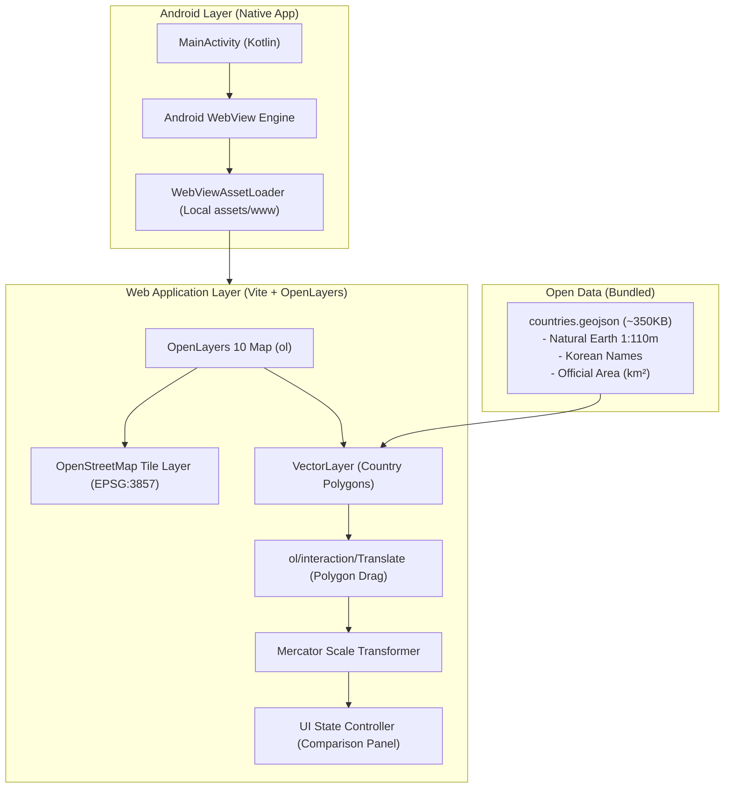

# 01. 시스템 아키텍처 및 설계 (System Architecture & Design)

## 1. 프로젝트 개요 (Overview)

* **프로젝트명**: 대한민국 바로알기 (True Size of Korea - Country Area Comparator)
* **목적**:
  * 메르카토르 도법(Web Mercator, EPSG:3857)을 사용하는 전 세계 지도에서 고위도로 갈수록 국가 크기가 극단적으로 왜곡되는 현상을 체감하고,
  * 대한민국의 실제 물리적 면적을 원하는 위도로 이동시켜 다른 국가들과 1:1로 직관적이고 객관적인 크기 비교를 제공.
  * 2개 국가의 면적($km^2$), 비율, 요약 정보를 한눈에 확인할 수 있는 교육용 지도 앱.
* **프로젝트 위치**: `D:\Documents\workspace\study\compare_country_area`

---

## 2. 전체 디렉터리 구성 (Directory Structure)

```text
compare_country_area/
├── doc/                            # [문서] 설계, 기술 스택, 수학 공식, 오픈 데이터 사양
│   ├── 01_SYSTEM_ARCHITECTURE.md
│   ├── 02_TECH_STACK_AND_LIBRARIES.md
│   ├── 03_MERCATOR_DISTORTION_MATH.md
│   └── 04_OPEN_DATA_SPECIFICATION.md
├── web/                            # [웹 코어] OpenLayers + OSM 기반 반응형 지도 웹 앱
│   ├── public/
│   │   └── data/
│   │       └── countries.geojson   # 경량 국가 경계 및 한글/면적 데이터
│   ├── src/
│   │   ├── map/                    # 지도 생성, 레이어, 스타일
│   │   ├── transform/              # 위도별 폴리곤 크기 보정 수학 알고리즘
│   │   ├── ui/                     # 상단 검색바, 하단 상세비교 시트, 툴팁
│   │   └── main.js
│   ├── index.html
│   ├── package.json
│   └── vite.config.js
└── android/                        # [안드로이드] 로컬 오프라인 구동용 WebView 래퍼 앱
    ├── app/
    │   ├── src/main/
    │   │   ├── assets/www/         # web 빌드 산출물 패키징
    │   │   ├── java/com/study/comparecountry/
    │   │   │   └── MainActivity.kt # 풀스크린 WebView 및 웹 브리지 설정
    │   │   └── AndroidManifest.xml
    │   └── build.gradle.kts
    └── settings.gradle.kts
```

---

## 3. 시스템 아키텍처 (Architecture)

### 3.1 3계층 하이브리드 구조 (Hybrid 3-Tier Architecture)



---

## 4. 핵심 데이터 흐름 및 상태 관리 (State Flow)

1. **초기 로딩 단계**:
   * `countries.geojson` 비동기 파싱 후 OpenLayers `VectorSource`에 로드.
   * 기본 선택 국가로 **대한민국(South Korea, KOR)** 자동 선택.
   * 한국 경계 폴리곤의 초기 중심점 위도 $\phi_0 \approx 36.5^\circ$ 및 원본 기하 데이터 캐싱.

2. **국가 선택 단계**:
   * **국가 A (기본: 한국)**: 비교 기준이 되는 드래그 가능한 폴리곤 (초록색 반투명 오버레이).
   * **국가 B (비교 대상)**: 지도상에서 클릭하거나 상단 검색창에서 선택한 국가 (파란색 반투명 오버레이).

3. **드래그 & 위도 왜곡 보정 인터랙션**:
   * 사용자가 한국 폴리곤을 잡고 원하는 위도(예: 영국 $54^\circ\text{N}$, 그린란드 $72^\circ\text{N}$)로 드래그.
   * 드래그 이벤트 발생 시 실시간으로 새 중심점 위도 $\phi_{new}$ 측정.
   * 선형 축척 보정치 $S = \frac{\cos(\phi_{original})}{\cos(\phi_{new})}$ 계산 후 폴리곤 꼭짓점 좌표 실시간 스케일링.
   * 메르카토르 지도 상에서 해당 위도에서의 실제 물리적 크기가 그대로 시각화됨.

4. **상세 비교 패널 갱신**:
   * 국가 A의 공식 면적과 국가 B의 공식 면적을 비교.
   * 면적비($\text{비율} = \frac{\text{면적}_B}{\text{면적}_A}$), 배수("영국은 한국의 약 2.4배"), 그래픽 바 차트 실시간 갱신.

---

## 5. UI/UX 와이어프레임 설계

```
┌────────────────────────────────────────────────────────┐
│ 🇰🇷 대한민국 바로알기              [🔍 국가 검색...] [↺] │
├────────────────────────────────────────────────────────┤
│                                                        │
│                    [ 지도 영역 ]                       │
│                                                        │
│       (그린란드 72°N)                                  │
│       ┌──────────────────┐                             │
│       │ 🇰🇷 대한민국(이동됨)│                             │
│       │ (위도 왜곡 보정됨)│                             │
│       └──────────────────┘                             │
│                                                        │
│                 (영국 54°N)                            │
│                 ┌──────────────┐                       │
│                 │ 🇬🇧 영국       │                       │
│                 └──────────────┘                       │
│                                                        │
│        [📍 원위치로 리셋]        [위도: 54.2°N | 배율: 1.4x]│
├────────────────────────────────────────────────────────┤
│ ▼ [ 📊 상세 면적 비교 ]                                 │
│ ────────────────────────────────────────────────────── │
│  기준 국가: 🇰🇷 대한민국 (100,432 km²)                  │
│  비교 국가: 🇬🇧 영국 (243,610 km²)                      │
│                                                        │
│  [■■■■■■■■░░░░░░░░░░░░] 한국: 41.2%                    │
│  [■■■■■■■■■■■■■■■■■■■■] 영국: 100% (한국의 약 2.4배)  │
│                                                        │
│  💡 팁: 메르카토르 지도에서는 고위도 국가가 훨씬 커 보이지만, │
│         실제 영국은 한반도(전체 약 22만km²)와 매우 비슷합니다! │
└────────────────────────────────────────────────────────┘
```
